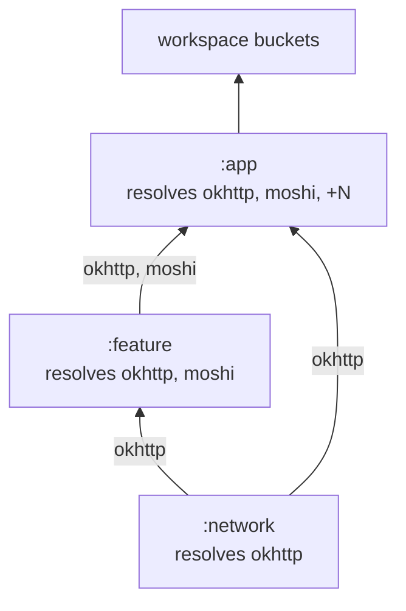
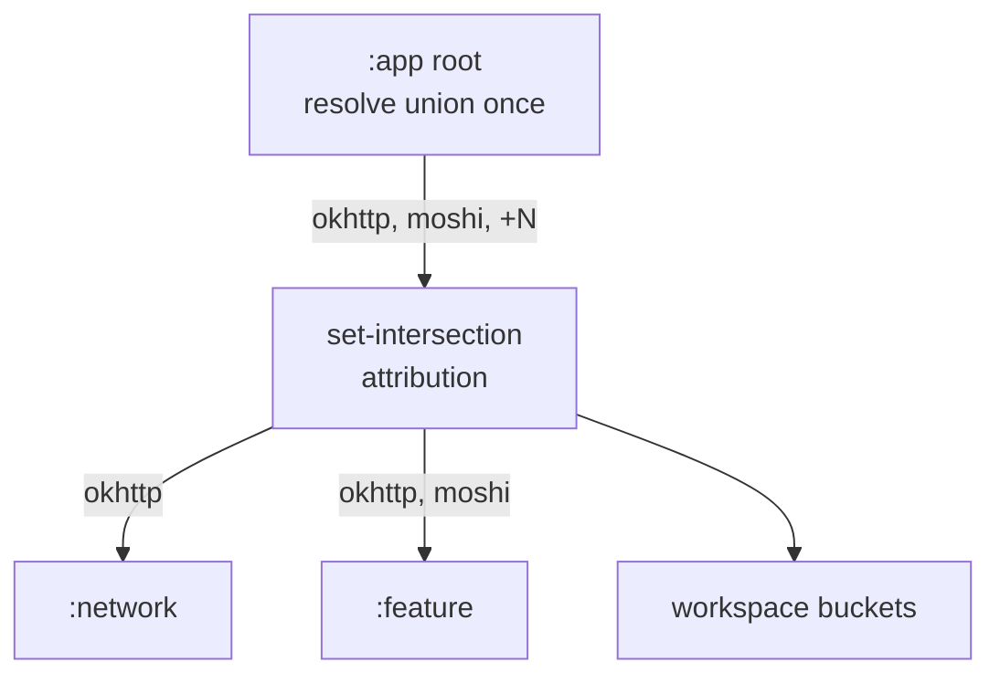
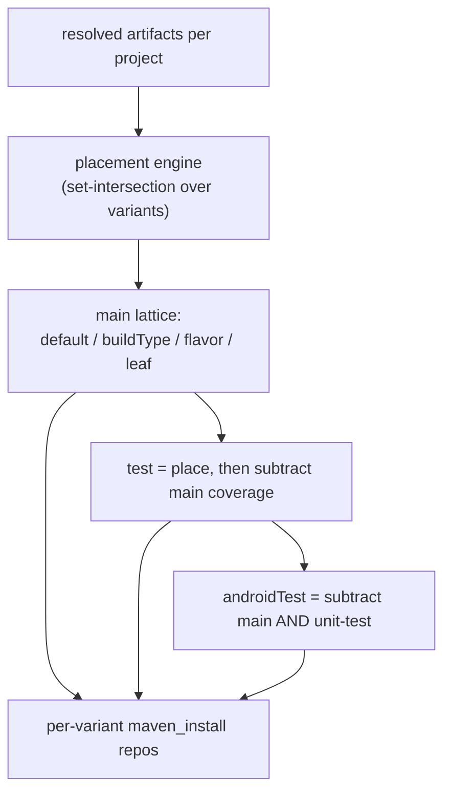
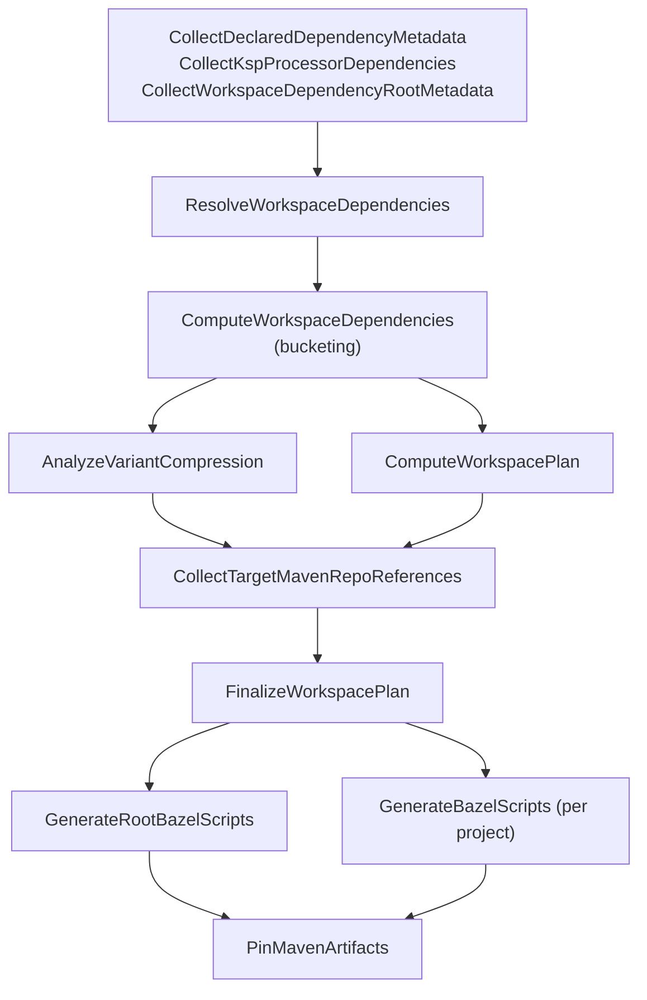
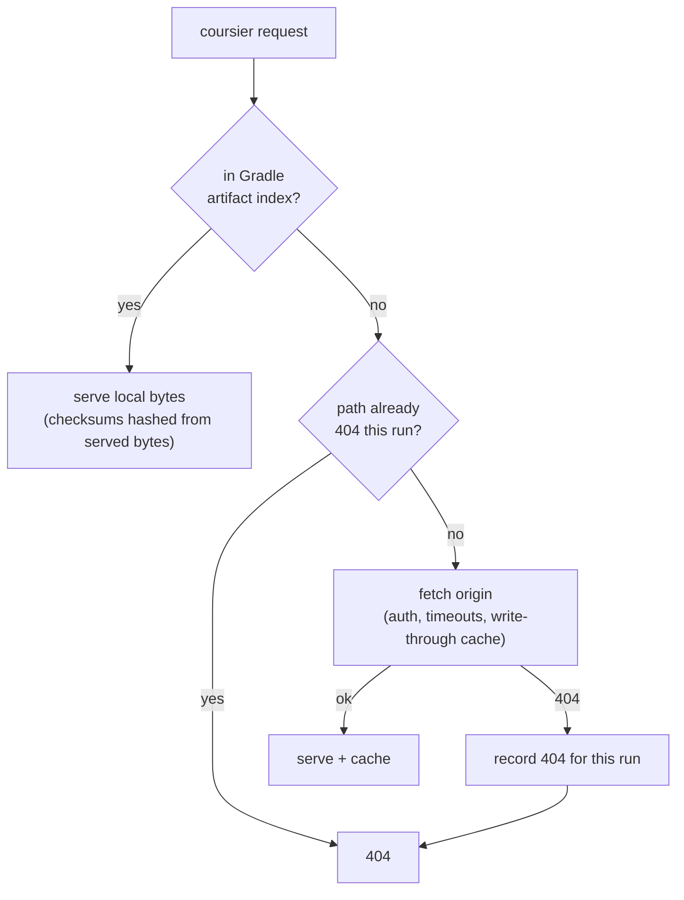

# Dependency Engine

The engine turns a Gradle project graph into the Bazel artifacts a build needs: a set of
per-variant `maven_install` repositories (pinned lockfiles) and the `deps`/`exports` edges each
generated target declares. It exists to make that translation both **complete** — every artifact a
target can reference at any variant resolves to a real label — and **byte-stable** — the same input
graph produces identical generated files on every run and every machine.

Three concerns compose the engine, in pipeline order: **resolution** (what external artifacts and
project edges exist), **bucketing** (which per-variant maven repo each artifact belongs to), and
**pinning** (turning resolved artifacts into a rules_jvm_external lockfile without re-downloading
the world). The local Maven proxy serves the third.

## Resolution models

A migratable Android project exposes many variant classpaths (build-type × flavor, plus unit-test,
android-test, and lint source sets). The resolver's job is to enumerate every external artifact and
`project(...)` edge across all of them, once, deterministically.

### Per-variant model (bottom-up)

Stock Grazel resolves **each module's each variant** independently and derives that module's buckets
from its own classpaths, then aggregates module results upward into the workspace. Resolution cost
scales with `modules × variants`, and a library shared by a hundred modules is resolved a hundred
times. Attribution is local: a module knows its own buckets directly because it resolved them.

An artifact travels through the graph as an edge label below: `okhttp` is resolved afresh at every
module whose classpath contains it, so the same coordinate is resolved once per consumer on the way
up.



### Aggregated model (top-down)

This engine inverts the direction. It seeds resolution **roots** from the binary projects only —
app modules and standalone `com.android.test` modules — because a binary's classpath already
contains the transitive union every library beneath it contributes. Each root is resolved once, and
per-project buckets are derived afterward by set-intersection across the resolved roots rather than
by resolving each project. A shared library is resolved as many times as there are binary roots
reaching it, not as many times as there are consumers.

The same coordinate is resolved once at the binary root and attributed down to each project it
reaches; `okhttp` carries no re-resolution cost per consumer.



The tradeoff the inversion accepts: aggregation **collapses** the per-project attribution the
bottom-up model gets for free. The engine reconstructs that attribution in two later steps —
reachability (which project a resolved artifact's edge belongs to) and bucketing (which variant) —
rather than reading it off each module's own resolution. Those reconstructions are the price of
resolving the graph a handful of times instead of thousands.

### Roots

`WorkspaceDependencyRootInputPlanner` (`grazel-gradle-plugin/src/main/kotlin/com/grab/grazel/gradle/dependencies/WorkspaceDependencyRootInputPlanner.kt`)
produces the root inputs. Each root carries a kind:

| Kind | Source | Purpose |
|---|---|---|
| `MAIN_HIERARCHY` | app AndroidBuild hierarchy-root variants | establishes main reachability |
| `MAIN_LEAF` | app leaf variants | leaf-specific main residual |
| `TEST_HIERARCHY` | app `test`/`androidTest` hierarchy variants | test classpath roots |
| `UNIT_TEST` / `ANDROID_TEST` | per-leaf test source sets | leaf-scoped test residuals |
| `LINT` | lint classpath per migratable project | lint bucket |

A root's identity is its `RootKey` — project path, configuration name, and kind
(`AggregatedDependencyRoot.kt`). Roots are resolved in a fixed order: `MAIN_HIERARCHY` first, so the
reachability facts they fold are visible to every later leaf and test root that reuses them.
`AggregatedDependencyResolver` (`.../gradle/dependencies/AggregatedDependencyResolver.kt`) walks each
root's resolution result through `ResolvedComponentsVisitor` and emits synthetic buckets consumed by
the `ComputeWorkspaceDependencies` pipeline.

## Bucketing

rules_jvm_external pins one lockfile per maven repo, and a generated Bazel target must pick its
external dependencies from the repo matching its own variant. Bucketing decides, for every resolved
artifact, which repo it belongs to. The bucket lattice:

`default`, per-`buildType`, per-`flavor`, per-leaf residual, `test`, `androidTest`, `lint`, and a
global KSP bucket.

Placement is **set-intersection**. `DependencyBucketPlacementEngine`
(`.../gradle/dependencies/bucket/DependencyBucketPlacementEngine.kt`) places each project's resolved
dependencies into this lattice: an artifact present across every variant lands in `default`; one
present only under a flavor lands in that flavor's bucket; and so on down the lattice.
`MainBucketPlanner` runs the engine per project, merges the independently-placed plans into
project-agnostic output buckets, and reconciles user-declared excludes and overrides back onto them.

Each resolved artifact lands in exactly one bucket, chosen by the set of variants it appears in. An
artifact in every variant is common and sinks to `default`; one confined to a single flavor,
build-type, or source set rises to that bucket. Test buckets take what is left after main coverage
is removed.

```text
  resolved graph (per variant presence)                 bucket
  ─────────────────────────────────────                 ──────
  okhttp        ∈ every variant  ─────────────────────► default
  moshi         ∈ every variant  ─────────────────────► default
  coil          ∈ demo flavor only ───────────────────► demo
  glide         ∈ full flavor only ───────────────────► full
  leakcanary    ∈ debug buildType only ───────────────► debug
  junit         ∈ unit-test only ─────────────────────► test         (minus default)
  espresso-core ∈ androidTest only ───────────────────► androidTest  (minus default, test)

  intersection of all variants ── default ──┐
                                             ├── a dependency sits in the
  symmetric difference per variant ── leaf ──┘   lowest bucket that still covers it
```



### Test bucket residuals

A generated test target depends on its main target and inherits main's entire classpath for free. A
test bucket therefore declares only what main does **not** already supply. `TestBucketPlanner`
(`.../gradle/dependencies/bucket/TestBucketPlanner.kt`) places test variants through the same engine
main uses, then subtracts everything main covers; android-test subtracts unit-test too,
which it also inherits.

The test subtraction is stricter than the coverage rule main applies among its own buckets. Main
placement partitions one shared classpath, so a dependency in two main buckets is the same resolved
artifact and can be disambiguated in place. A test root can share a main root's exact resolved
identity yet pull a *larger* transitive closure than main did for that artifact; treating it as
"already provided" on identity alone would drop the extra transitives and starve the test target. A
main dependency covers a test root only when it is itself a direct root whose transitive closure is
a superset of the test root's — the `canCoverTest` rule in `Coverage.kt`. Anything short of that
stays in the test bucket.

## Pipeline

The tasks run as a dependency DAG. Resolution and metadata collection feed bucketing
(`ComputeWorkspaceDependencies`), which feeds the workspace plan; reference collection completes the
generation set; the finalized plan drives script generation and pinning.



The workspace plan (`WorkspacePlan`, `WorkspaceRenderPlan` under
`.../gradle/dependencies/model/`) is the serialized handoff between resolution/bucketing and both
generation and pinning: it carries the per-repo pin inputs and the referenced-target set. Task
wiring lives in `.../tasks/internal/TaskManager.kt`.

### Root configuration consumers

Two tasks sit outside that DAG and consume the resolution **roots** directly, wired by
`WorkspaceDependencyInputsRegistrar` rather than by a serialized plan. Both hold the root
configurations and resolve them from their own task action, because querying an artifact-resolution
provider for a subproject's configuration from a root-project task fails on Gradle's project state
lock:

| Task | Roots consumed | Purpose |
|---|---|---|
| `PinMavenArtifacts` | all roots | the proxy's Gradle-resolved facts (see below) |
| `AndroidDatabindingMetaData` | `MAIN_HIERARCHY`, `MAIN_LEAF` | `databinding_info.bazelrc` |

`AndroidDatabindingMetaData` scans each external `aar` on those roots for its `-br.bin` entry to map
artifacts to databinding packages. Main roots only: their classpaths are the aggregated equivalent of
the non-test Android variants this metadata was derived from under the per-variant model, and test or
lint roots would contribute artifacts the flag never carried. Because the roots are already resolved
for the pipeline above, the task adds no resolution of its own — the reason it consumes roots at all
rather than walking every module's classpath, which is what it did before the inversion.

## Local Maven proxy and pinning

`PinMavenArtifacts` hands each maven repo's artifact list to rules_jvm_external, which shells out to
coursier to resolve, download, checksum, and write a lockfile. Two problems make a naive pin
unacceptable: coursier resolves independently of Gradle and can select different versions than the
build already resolved, and it re-downloads artifacts Gradle already has on disk. The local Maven
proxy (`experiments.localMavenResolution`) solves both by standing between coursier and the real
repositories, backed by Gradle's own resolution.

### Gradle-resolved facts

`LocalMavenResolvedFactsBuilder` (`.../gradle/dependencies/LocalMavenResolvedFactsBuilder.kt`) builds
the proxy's model from live Gradle resolution at pin time — never from any committed lockfile:

- an **artifact index** — resolved-artifact files keyed by Maven path, from the roots' resolved
  artifact views, gap-filled from Gradle's module cache;
- **known-component GAVs** — every component in the resolved graph;
- **metadata-only GAVs** — known components that resolve to no concrete artifact;
- a **POM resolver** over the same resolved set.

### Serve tiers

The proxy is a best-effort mirror that **cannot fail a build**. Every request either serves
Gradle's local bytes or falls through to origin; no branch returns a hard error.
`LocalMavenProxyServer` (`.../proxy/LocalMavenProxyServer.kt`) dispatches:



A known-component artifact missing from the local index falls through like any other request and is
counted as a known-component fallthrough — a signal the local index is eroding, not a failure. The
404 memo dedupes coursier's routine classifier probes (`-sources`, `-javadoc`) within a single pin
run; it is cleared each time the proxy is reconfigured, so a transient origin 404 never persists
across runs. The pin summary reports served-locally versus fell-through-to-origin counts.

### Reconstruction and the input signature

Coursier pins against proxy URLs, so the lockfile it writes references `127.0.0.1`.
`MavenInstallLockfileReconstructor` and `MavenLockfileRepositoryUrlRewriter`
(`.../migrate/dependencies/`) rewrite those back to canonical repository URLs. rules_jvm_external
guards a pinned lockfile with an **input-signature hash** over the maven repo's artifact and
repository lists; a mismatch makes it reject the lockfile as out of date.
`RulesJvmExternalLockfileHasher` recomputes that hash from the same repository model the WORKSPACE
declares, so the reconstructed signature matches what rules_jvm_external validates.

The repository list a consumer's WORKSPACE post-processing removes must be excluded from the model
too, or the hash diverges. `excludeExternalRepositoryVariables` on the maven-install extension
(`.../extension/MavenInstallExtension.kt`) is that declaration: it drops a repository variable (for
example the Dagger repositories, when a consumer patches them out of the generated WORKSPACE) from
rendering, proxy origins, and the signature hash together, from one field.

POM-packaging artifacts (parent and BOM POMs with no jar) follow rules_jvm_external's own rule: an
artifact is `skipped` only when the resolver fetched no bytes for it, independent of packaging or
whether it was explicitly requested. Reconstruction records what it resolved and never reclassifies
a resolved POM as skipped.

### Baseline reconciliation

When a prior lockfile exists, `BaselineLockfileFactsMerger` asserts the reconstruction against it:
matching artifacts must carry identical shasums, and an artifact the baseline resolved must not come
back skipped. These are correctness assertions, not inputs — the proxy model is never seeded from
the baseline. With no baseline, rules_jvm_external's own signature validation is the correctness
oracle.

### Cold-start determinism

Because no committed lockfile configures the proxy, the reconstruction, or the bucketing, deleting
every `*_install.json` and running a single migrate reproduces byte-identical lockfiles and
WORKSPACE. A missing lockfile is a supported starting state: generation renders the pinned-install
attribute commented out, and a pre-flight unpins any WORKSPACE that references a lockfile absent on
disk before the first Bazel invocation runs against it.

## Reachability

Aggregation resolves the union at the binary roots, so the resolved graph alone cannot say which
project a given artifact or edge belongs to, nor which projects are actually built. Reachability
rebuilds both. It gates target generation: a project no binary root reaches emits no `BUILD.bazel`,
which prevents silently under-linked files for modules outside the build while still catching a
module that should have resolved but did not.

`MainReachabilityTracker` (`.../gradle/dependencies/resolution/MainReachabilityTracker.kt`) folds
reachability from two channels as it walks the main roots:

- a **declared-edge DFS seed** — the `project(...)` edges each root declares, giving the initial
  reachable set and per-edge exclude scopes;
- a **walk fold** over `RootVisitOutcome` — the buckets actually touched while visiting each root,
  which carries bucket-name attribution the declared edges alone do not.

Both channels are load-bearing: on a large graph a minority of roots diverge between the two, almost
always on bucket-name attribution for a path the declared seed already reached.

Target generation needs one extra completion. A library consumed **only** through a test classpath
(for example a test-util module referenced solely via `testImplementation`) is reached by no
binary's main graph, yet consumers still declare edges to it. The render plan's referenced-target
set closes this: every target builder combines `isReachableProjectVariant(...)` with an
`isReferencedGeneratedTarget(...)` fallback, so a target referenced by an already-collected target
generates even when its own bucket is not main-reachable. `CollectTargetMavenRepoReferencesTask`
visits projects consumers-first over a reachability graph that includes test edges, so a referenced
module's references are populated before it is visited, forming the transitive closure.

## File structure

| Area | Path (`grazel-gradle-plugin/src/main/kotlin/com/grab/grazel/`) |
|---|---|
| Root planning | `gradle/dependencies/WorkspaceDependencyRootInputPlanner.kt`, `gradle/dependencies/AggregatedDependencyRoot.kt` |
| Resolution | `gradle/dependencies/AggregatedDependencyResolver.kt`, `gradle/dependencies/ResolvedComponentsVisitor.kt`, `gradle/dependencies/resolution/` |
| Reachability | `gradle/dependencies/resolution/MainReachabilityTracker.kt`, `gradle/dependencies/resolution/RootVisitOutcome.kt` |
| Bucketing | `gradle/dependencies/bucket/` (`DependencyBucketPlacementEngine.kt`, `MainBucketPlanner.kt`, `TestBucketPlanner.kt`, `Coverage.kt`) |
| Plan model | `gradle/dependencies/model/`, `gradle/dependencies/WorkspacePlanBuilder.kt`, `gradle/dependencies/WorkspaceRenderPlanBuilder.kt` |
| Proxy | `proxy/LocalMavenProxyServer.kt`, `proxy/LocalMavenProxyService.kt`, `gradle/dependencies/LocalMavenResolvedFactsBuilder.kt` |
| Pinning | `migrate/dependencies/ArtifactPinner.kt`, `migrate/dependencies/MavenInstallLockfileReconstructor.kt`, `migrate/dependencies/RulesJvmExternalLockfileHasher.kt`, `migrate/dependencies/BaselineLockfileFactsMerger.kt` |
| Extension | `extension/MavenInstallExtension.kt` |
| Root consumers | `tasks/internal/AndroidDatabindingMetaDataTask.kt`, `gradle/dependencies/ExternalModuleArtifacts.kt` |
| Task wiring | `tasks/internal/TaskManager.kt` |
